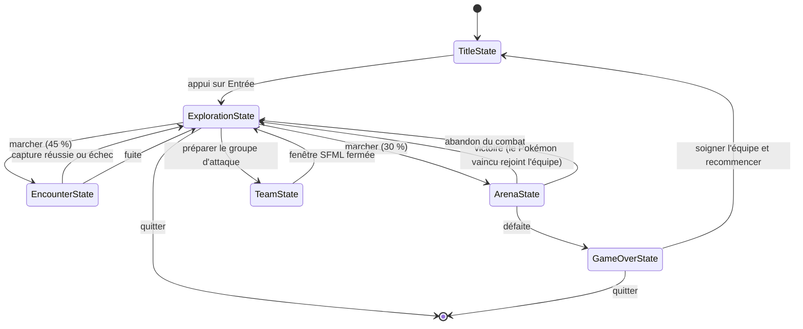

# Pokemon Selector : introduction à la POO en C++ (IS_3436)

TP de 3ème année IS, ENSEA.
Moteur de jeu Pokémon en C++17 avec interface graphique SFML.

## Dépendances

- `g++` avec support C++17
- SFML 2.5 (`sudo apt-get install libsfml-dev`)
- Optionnel : `valgrind` pour la recherche de fuites mémoire

## Compilation et exécution

| Commande | Effet |
| --- | --- |
| `make` | compile `bin/main.exe` |
| `make run` | compile puis lance le programme |
| `make clean` | supprime `bin/` |

Aucun fichier n'est listé à la main dans le Makefile : ajouter un `src/*.cpp` suffit.

## Structure

```
.
├── includes/        # fichiers .hpp (une classe = un fichier)
├── src/             # implémentations .cpp + main.cpp
├── data/            # pokedex.csv
├── assets/image/    # sprites des Pokémon + éléments d'interface
└── bin/             # produits de compilation (non versionnés)
```

Format de `data/pokedex.csv` :

```
#,Name,Type 1,Type 2,Total,HP,Attack,Defense,Sp. Atk,Sp. Def,Speed,Generation,Legendary
1,Bulbasaur,Grass,Poison,318,45,49,49,65,65,45,1,False
```

Le sprite d'un Pokémon est `assets/image/pokemon/<numéro>.png`.

## Classes

### Modèle

- `Pokemon` : numéro, nom, évolution, PV max / courants, attaque, défense, méthode d'attaque.
  `clone()` renvoie un `std::unique_ptr<Pokemon>`.
- `Pokemon_Vector` : classe abstraite représentant une liste de Pokémon. Conteneur en
  `std::vector<std::shared_ptr<Pokemon>>`, itérateurs `begin()` / `end()`, et trois méthodes
  prenant une lambda : `countIf`, `filter`, `sortBy`.
- `Pokedex` : hérite de `Pokemon_Vector`, singleton construit à partir du CSV ;
  ses données sont inaccessibles, on n'en extrait que des clones.
- `Pokemon_Party` : hérite de `Pokemon_Vector`, l'ensemble des Pokémon du joueur, sans limite de taille.
- `Pokemon_Attack` : hérite de `Pokemon_Vector`, extrait de 6 Pokémon de la `Pokemon_Party`,
  avec réintégration (`giveBack`) et placement (`swapPositions`).

### Moteur de jeu

- `AbstractState` : classe abstraite, un état du jeu.
- `GameEngine` : le contexte, il détient l'état courant en `std::unique_ptr` et la boucle de jeu.
- `TitleState`, `ExplorationState`, `EncounterState`, `ArenaState`, `TeamState`, `GameOverState`.

### Interface graphique

- `Button` : rectangle cliquable dont l'action est une lambda (`std::function<void()>`).
- `SelectionScreen` : écran SFML de composition du `Pokemon_Attack`.

## Règle d'attaque

Quand un Pokémon en attaque un autre :

```
dégâts = max(1, attaque_attaquant - défense_cible / 2)
```

- La défense **réduit** les dégâts sans jamais les annuler : une attaque inflige toujours
  au moins 1 point de dégât, même face à un mur comme Onix.
- Les points de vie ne descendent jamais sous zéro.
- Un Pokémon KO ne peut ni attaquer, ni être attaqué, ni s'attaquer lui-même.

## Graphe d'états (design pattern STATE)



Les transitions sont **différées** : un état demande le changement depuis son propre `run()`,
le moteur ne remplace l'état courant qu'une fois `run()` revenu. Écraser le `unique_ptr`
immédiatement détruirait l'objet en cours d'exécution.
